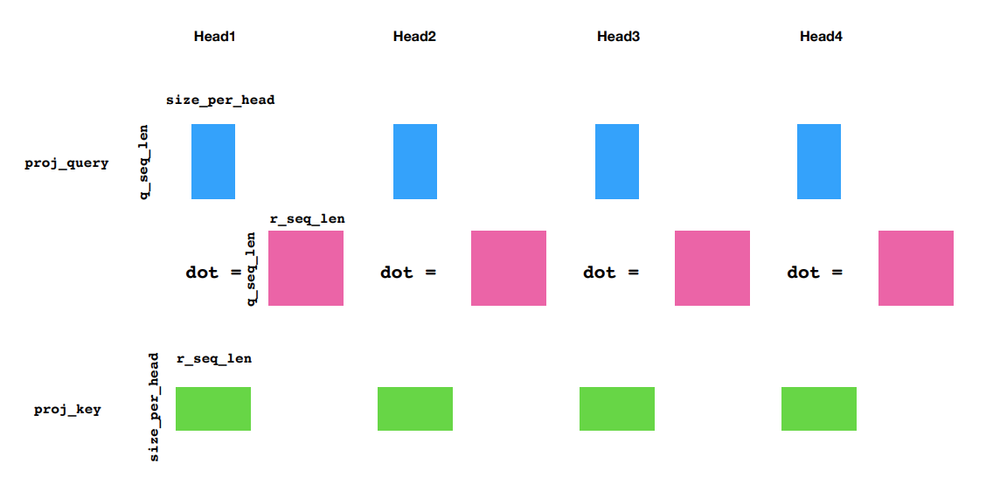
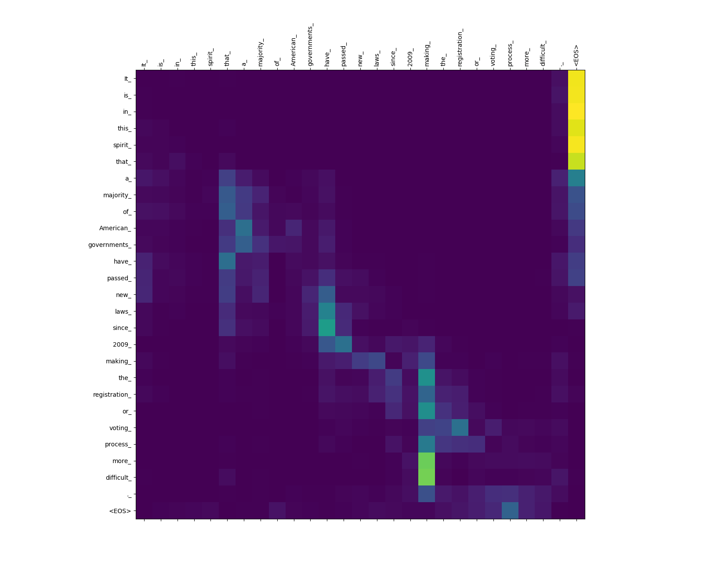
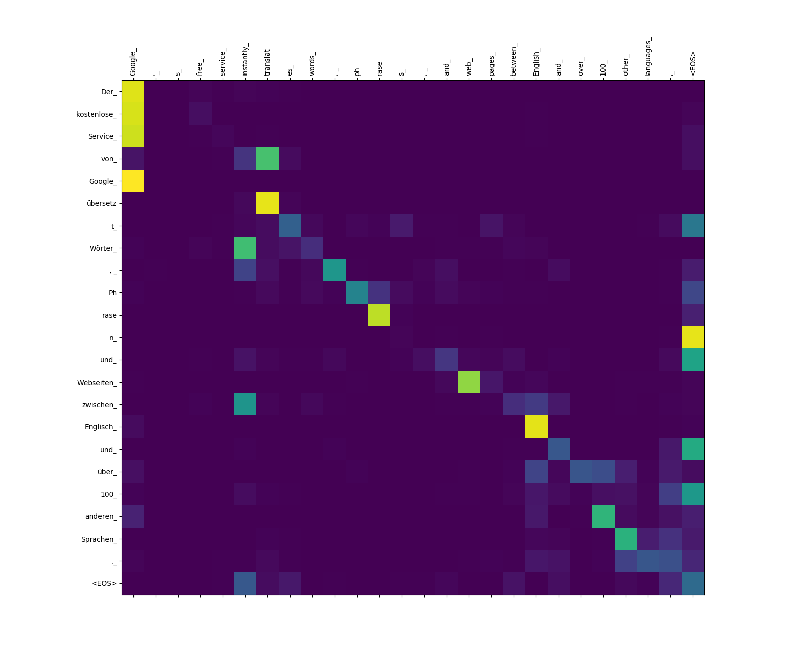
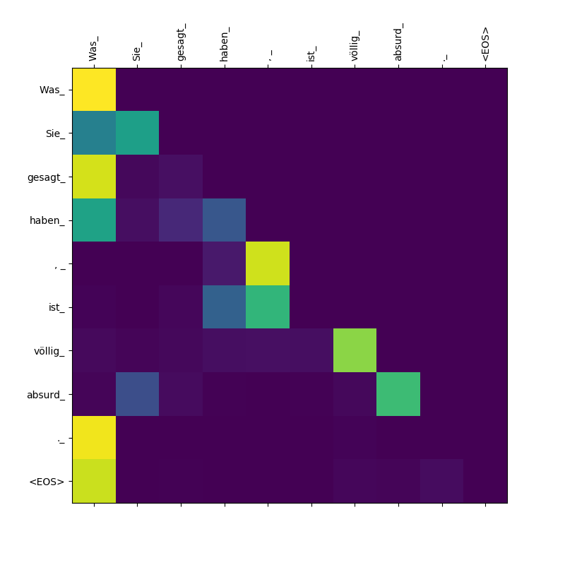

# TensorFlow 2.x Implementation of Transformer Model for Neural Machine Translation 

This is a TensorFlow 2.x implementation of Transformer model ([Attention is all you need](https://arxiv.org/abs/1706.03762])) for Neural Machine Translation (NMT). 

## Transformer Model
Transformer is a novel yet simple network architecture for sequence modeling. Unlike other neural sequence modeling approaches where the dependence relationship between symbols is baked into the architecture of Recurrent Neural Networks (RNN), the Transformer models the symbol-to-symbol dependence relationship solely based on attention mechanism, dispensing with the sequential computation of RNNs. 

At the core of the Transformer model is the *self-attention* mechanism used by the *encoder*, where we encode a sequence of symbols by making each symbol *attend* to other symbols in the same sequence. Specifically, each symbol `s` (embedding vector of a word or subword token) is first transformed into three vectors, namely the `query`, the `key`, and the `value`. Then a new representation of the symbol `s` is computed as the average of the `value` vectors across each and every symbol `t` in the sequence, weighted by the similarity between the `query` of `s` and the `key` of `t`. Because the similarity is simply computed as the dot product, one can flexibly model the dependence between any two symbols, regardless of their distance in the sequence.

<p align="center ">
  

  <br>
  Computing the pairwise token-to-token similarity matrix by dot product
</p>


The idea of self-attention is so influtial that has inspired recent breakthroughs in methods of language model pretraining such as [BERT](https://arxiv.org/abs/1810.04805) and [GPT-2](https://openai.com/blog/better-language-models/).

## Requirements
This implementation is based on TensorFlow 2.x and Python3. In addition, NLTK is required to compute BLEU score for evaluation.


## Installation
You can clone this repository by running

```bash
git clone git@github.com:chao-ji/tf-transformer.git
```

## Data Preparation

The training corpus should be in the form of a list of text file(s) in source language, paired with a list of text file(s) in target language, where the lines (i.e. sentences) in source language text files have one-to-one correspondence to lines in target language text files 

```
source_file_1.txt   target_file_1.txt
source_file_2.txt   target_file_2.txt
...
source_file_n.txt   target_file_n.txt

```

First you need to convert raw text files into TFRecord files, by running
```bash
python data/tfrecord.py \
  --source_filenames=source_file_1.txt,source_file_2.txt,...,source_file_2.txt \
  --target_filenames=target_file_1.txt,target_file_2.txt,...,target_file_2.txt \
  --output_dir=/path/to/tfrecord/directory \
  --vocab_name=vocab
```
Note: this process involves "learning" a vocabulary of subword tokens from the training corpus, which is saved to files `vocab.subtokens` and `vocab.alphabet`. The vocabulary will be later used to encode raw text string into subword token ids, or decode them back to raw text string.

For detailed usage info, run
```bash
python data/tfrecord.py --help
``` 

For sample data, refer to [data\_sources.txt](data_sources.txt)

## Training

To train a model, run

```bash
python run_trainer.py \
  --data_dir=/path/to/tfrecord/directory \
  --vocab_path=/path/to/vocab/files \
  --model_dir=/path/to/directory/storing/checkpoints 
```

`data_dir` is the directory storing the TFRecord files, `vocab_path` is the path to the basename of the vocabulary files `vocab.subtokens` and `vocab.alphabet` (i.e. path to `vocab`) generated by running `tfrecord.py`, and `model_dir` is the directory that checkpoint files will be saved to (or loaded from if training is resumed from a previous checkpoint).

For detailed usage info, run

```bash
python run_trainer.py --help
```

## Evaluation

The evaluation involves translating a source sequence into the target sequence, and computing the BLEU score between predicted and groundtruth target sequence.

To evaluate a pretrained model, run

```bash
python run_evaluator.py \
  --source_text_filename=/path/to/source/text/file \
  --target_text_filename=/path/to/target/text/file \
  --vocab_path=/path/to/vocab/files \
  --model_dir=/path/to/directory/storing/checkpoints 
```

`source_text_filename` and `target_text_filename` are the paths to the text files holding source and target sequences, respectively.

Note the command line argument `target_text_filename` is optional -- If left out, the evaluator will be run in **inference** mode, where only the translations will be written to the output file. 

For more detailed usage info, run

```bash
python run_evaluator.py --help
```


## Visualize Attention Weights

Note that the attention mechanism computes token-to-token similarities that can be visualized to understand by how much a token attends to other tokens. When you run `python run_evaluator.py` the attention weight matrices are saved to `.npy` files, which can be displayed by running:   

```bash
python run_visualizer.py \
  --attention_file=/path/to/attention_data_file.npy \
  --vocab_path=/path/to/vocab/files
```

Shown below are three sentences in English (source language) and their translations in German (target language).

**Input sentences in source langauge**

```
1. It is in this spirit that a majority of American governments have passed new laws since 2009 making the registration or voting process more difficult.
2. Google's free service instantly translates words, phrases, and web pages between English and over 100 other languages.
3. What you said is completely absurd.
```

**Translated sentences in target language**
```
1. In diesem Sinne haben die meisten amerikanischen Regierungen seit 2009 neue Gesetze verabschiedet, die die Registrierung oder das Abstimmungsverfahren schwieriger machen.
2. Der kostenlose Service von Google übersetzt Wörter, Phrasen und Webseiten zwischen Englisch und über 100 anderen Sprachen.
3. Was Sie gesagt haben, ist völlig absurd.
```

The transformer model computes three types of attentions: 

* source-source: source sentence attends to source sentence (used in Encoder).


<p align="center ">
  
  <br>
  Source-to-Source attention weights.  
</p>

Notice the attention weight from `more_` and `difficult_` to `making` -- they are actively "searching" for the verb when trying to complete the phrase "make ... more difficult".

* target-source: target sentence attends to source sentence (used in Decoder).
<p align="center ">
  
  <br>
  Target-to-Source attention weights.
</p>

Notice the attention weight from `uebersetz` (target) to `translat` (source), from `Webseiten` (target) to `web` (source), etc. This is probably due to their synonymity in German and English.

* target-target: target sentence attends to target sentence (used in Decoder).
<p align="center ">
  
  <br>
  Target-to-Target attention weights.
</p>

Notice the attention paid to `Was` by `Was`, `Sie_`, `gesagt`, `haben_` -- as the decoder spits out these subtokens, it needs to "be aware" of the scope of the clause `Was Sie gesagt haben` (meaning "what you've said").

## Reference
* [TensorFlow official implementation of Transformer](https://github.com/tensorflow/models/tree/master/official/nlp/transformer)
* [Attention is all you need](https://arxiv.org/pdf/1706.03762), Vaswani *et al.* 2017.
