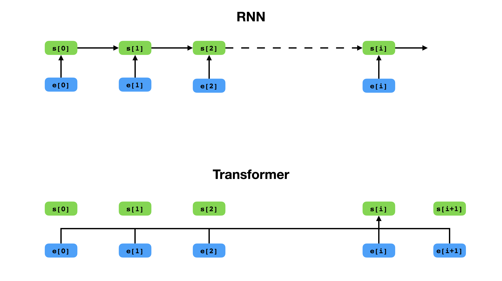
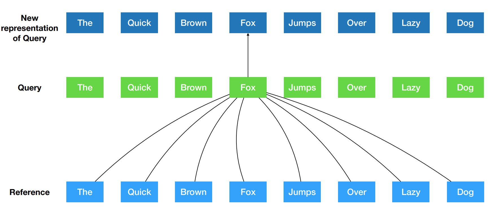
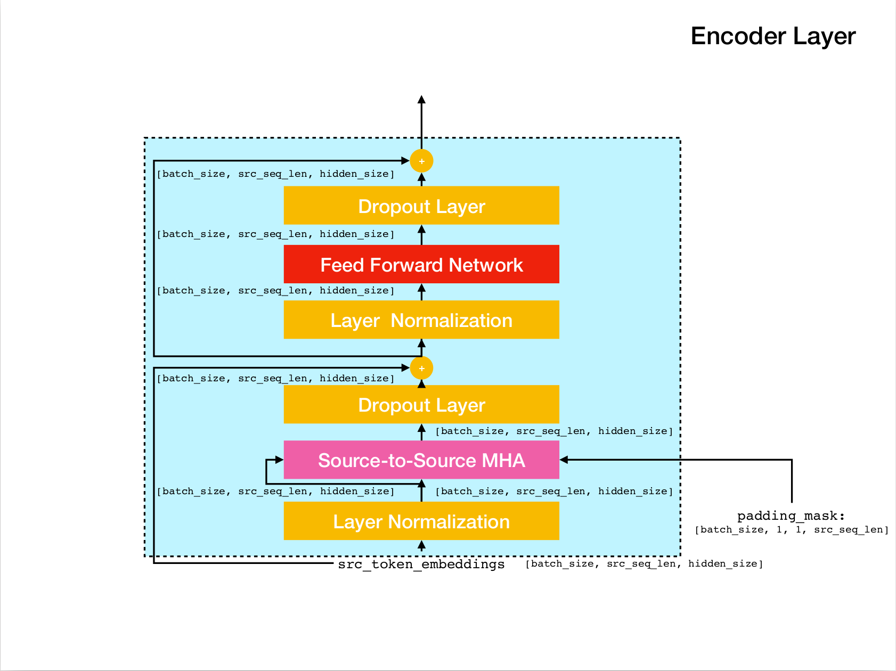
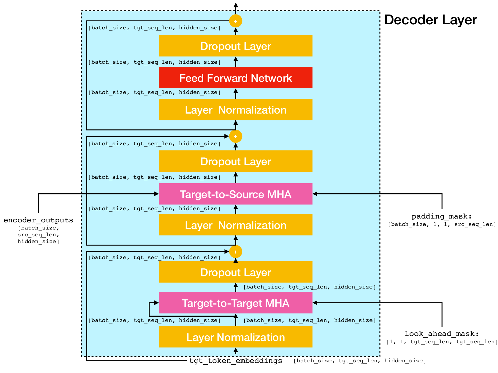
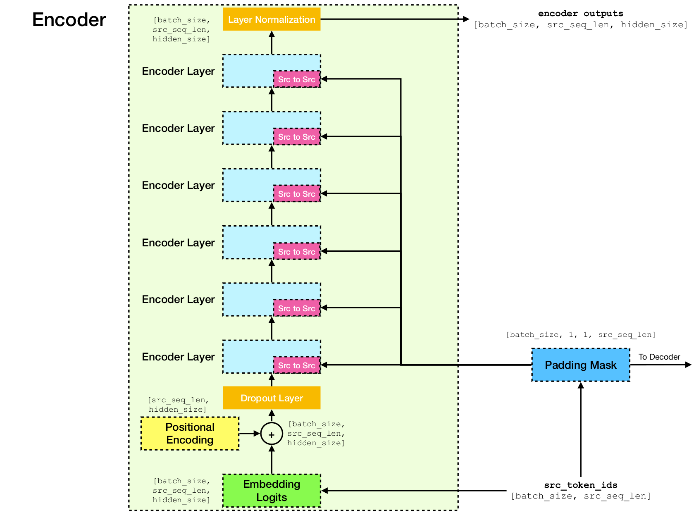
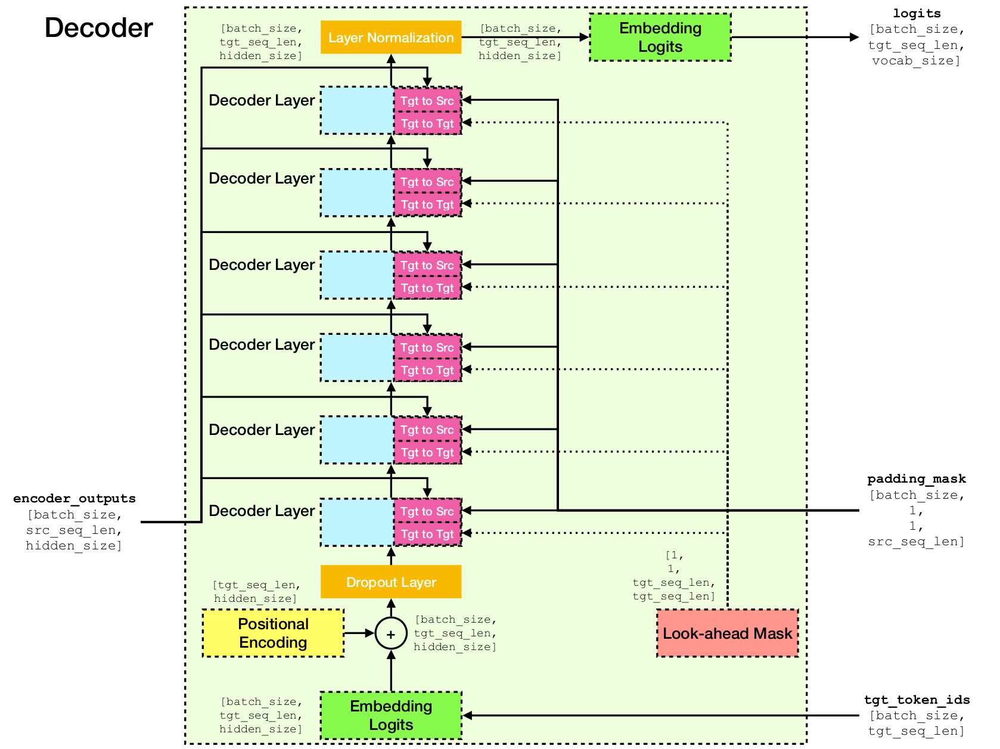

# TensorFlow 2.x Implementation of Transformer Model for Neural Machine Translation

This is a TensorFlow 2.x implementation of Transformer model ([Attention is all you need](https://arxiv.org/abs/1706.03762])) for Neural Machine Translation (NMT).


<p align="center">
  

  <br>
  Transformer has a more flexible way of representing the context compared with RNN.
</p>

## Transformer Model
Transformer is a deep neural network architecture for sequence modeling, which is the task to estimate the likelihood of tokens in a sequence based on their textual context. While Recurrent Neural Networks collapse the embeddings of the entire history of context tokens into a single vector, Transformer has access to the embedding vector of each individual token, no matter how far the context spans. This makes it well suited for modeling long-distance dependence relationships, which is key to recent breakthroughs in methods for text representation learning such as [BERT](https://arxiv.org/abs/1810.04805) and [GPT-2](https://openai.com/blog/better-language-models/).

At the core of Transformer is the **Self-Attention** mechanism, where the goal is to compute a *contextualized* representation of each token in a sequence by letting them "pay attention" to each other. Given the initial vector representations `e[i]` for all positions `i`, it first applies linear projections to obtain vectors `q[i]`, `k[i]`, `v[i]`, where `k`'s and `v`'s play the role of the *key* and *value* of a knowledge base about the sequence content, which is to be *queried* by `q[i]` to determine which tokens are most similar to the token at index `i`. The outcome of the query is simply the similarity scores between `q[i]` and `k`'s (typically dot-products), which are used as weights to compute a weighted average of the `v`'s as the new representation of `e[i]`. Note that `q`, `k` and `v` are derived from the *same* sequence, meaning the sequence is effectively querying itself (hence the name Self-Attention).

<p align="center">
  

  <br>
  Self-Attention mechanism. 
</p>


<p align="center">
  
  
  
  

  <br>
  Transformer Network Architecture.
</p>

## Requirements
This implementation is based on TensorFlow 2.x and Python3. In addition, NLTK is required to compute BLEU score for evaluation.


## Installation
You can clone this repository by running

```bash
git clone git@github.com:chao-ji/tf-transformer.git
```

Then clone & update the submodule by running
```bash
cd tf-transformer
git submodule update --init --recursive
```

## Data Preparation

The training corpus should be in the form of a list of text file(s) in source language, paired with a list of text file(s) in target language, where the lines (i.e. sentences) in source language text files have one-to-one correspondence to lines in target language text files

```
source_file_1.txt   target_file_1.txt
source_file_2.txt   target_file_2.txt
...
source_file_n.txt   target_file_n.txt

```

First you need to convert raw text files into TFRecord files by running
```bash
python commons/create_tfrecord_machine_translation.py \
  --source_filenames=source_file_1.txt,source_file_2.txt,...,source_file_2.txt \
  --target_filenames=target_file_1.txt,target_file_2.txt,...,target_file_2.txt \
  --output_dir=/path/to/tfrecord/directory \
  --vocab_name=vocab
```
Note: this process involves "learning" a vocabulary of subword tokens from the training corpus, which is saved to files `vocab.subtokens` and `vocab.alphabet`. The vocabulary will be later used to encode raw text string into subword token ids, or decode them back to raw text string.

For detailed usage info, run
```bash
python commons/create_tfrecord_machine_translation.py --help
```

For sample data, refer to [data\_sources.txt](data_sources.txt)

## Training

To train a model, run

```bash
python run_trainer.py \
  --data_dir=/path/to/tfrecord/directory \
  --vocab_path=/path/to/vocab/files \
  --model_dir=/path/to/directory/storing/checkpoints
```

`data_dir` is the directory storing the TFRecord files, `vocab_path` is the path to the basename of the vocabulary files `vocab.subtokens` and `vocab.alphabet` (i.e. path to `vocab`) generated by running `create_tfrecord_machine_translation.py`, and `model_dir` is the directory that checkpoint files will be saved to (or loaded from if training is resumed from a previous checkpoint).

For detailed usage info, run

```bash
python run_trainer.py --help
```

## Evaluation

The evaluation involves translating a source sequence into the target sequence, and computing the BLEU score between predicted and groundtruth target sequence.

To evaluate a pretrained model, run

```bash
python run_evaluator.py \
  --source_text_filename=/path/to/source/text/file \
  --target_text_filename=/path/to/target/text/file \
  --vocab_path=/path/to/vocab/files \
  --model_dir=/path/to/directory/storing/checkpoints
```

`source_text_filename` and `target_text_filename` are the paths to the text files holding source and target sequences, respectively.

Note the command line argument `target_text_filename` is optional -- If left out, the evaluator will run in **inference** mode, where only the translations will be written to the output file.

For more detailed usage info, run

```bash
python run_evaluator.py --help
```


## Visualize Attention Weights

Note that the attention mechanism computes token-to-token similarities that can be visualized to understand how the attention is distributed over different tokens. When you run `python run_evaluator.py` the attention weight matrices will be saved to file `attention_xxxx.npy`, which stores a dict of the following entries:

* `src`: numpy array of shape `[batch_size, src_seq_len]`, where each row is a sequence of token IDs that ends with 1 (`EOS_ID`) and padded with zeros.
* `tgt`: numpy array of shape `[batch_size, tgt_seq_len]`, where each row is a sequence of token IDs that ends with 1 (`EOS_ID`) and padded with zeros.
* `src_src_attention`: numpy array of shape `[batch_size, num_heads, src_seq_len, src_seq_len]`
* `tgt_src_attention`: numpy array of shape `[batch_size, num_heads, tgt_seq_len, src_seq_len]`
* `tgt_tgt_attention`: numpy array of shape `[batch_size, num_heads, tgt_seq_len, tgt_seq_len]`

The attention weights can be displayed by running:

```bash
python run_visualizer.py \
  --attention_file=/path/to/attention_xxxx.npy \
  --head=attention_head \
  --index=seq_index \
  --vocab_path=/path/to/vocab/files
```
where `head` is an integer in `[0, num_heads - 1]` and `index` is an integer in `[0, batch_size - 1]`.

Shown below are three sentences in English (source language) and their translations in German (target language).

**Input sentences in source langauge**

```
1. It is in this spirit that a majority of American governments have passed new laws since 2009 making the registration or voting process more difficult.
2. Google's free service instantly translates words, phrases, and web pages between English and over 100 other languages.
3. What you said is completely absurd.
```

**Translated sentences in target language**
```
1. In diesem Sinne haben die meisten amerikanischen Regierungen seit 2009 neue Gesetze verabschiedet, die die Registrierung oder das Abstimmungsverfahren schwieriger machen.
2. Der kostenlose Service von Google übersetzt Wörter, Phrasen und Webseiten zwischen Englisch und über 100 anderen Sprachen.
3. Was Sie gesagt haben, ist völlig absurd.
```

The transformer model computes three types of attentions:

* **source-source**: source sentence attends to source sentence (used in Encoder).


<p align="center ">
  
  <br>
  Source-to-Source attention weights.
</p>

Notice the attention weight from `more_` and `difficult_` to `making_` -- they are "on the lookout" for the verb "make" when trying to complete the phrase "make ... more difficult".

* **target-source**: target sentence attends to source sentence (used in Decoder).
<p align="center ">
  
  <br>
  Target-to-Source attention weights.
</p>

Notice the attention weight from `übersetz` (target) to `translat` (source), and from `Webseiten` (target) to `web` (source), etc. This is probably due to their synonymity in German and English.

* **target-target**: target sentence attends to target sentence (used in Decoder).
<p align="center ">
  
  <br>
  Target-to-Target attention weights.
</p>

Notice the attention paid to `Was` by `Was`, `Sie_`, `gesagt`, `haben_` -- as the decoder spits out these subtokens, it needs to "be aware" of the scope of the clause `Was Sie gesagt haben` (meaning "what you've said").

## Reference
* [TensorFlow official implementation of Transformer](https://github.com/tensorflow/models/tree/master/official/nlp/transformer)
* [Attention is all you need](https://arxiv.org/pdf/1706.03762), Vaswani *et al.* 2017.
